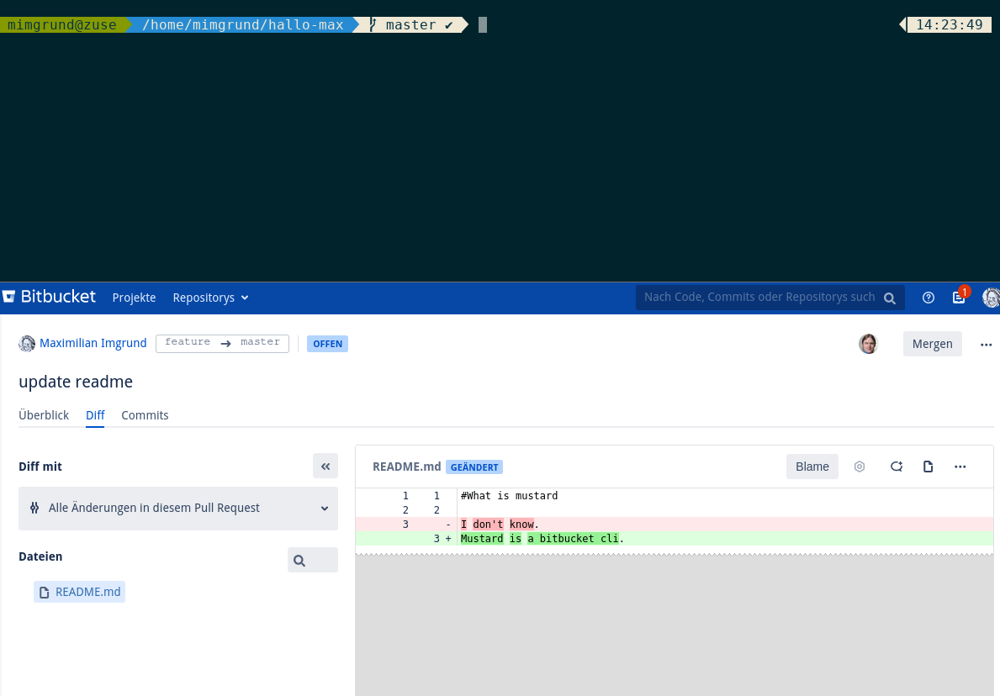

# Mustard - A Bitbucket CLI
## What is it?
Mustard is a command line interface for bitbucket that facilitates reviewing and commenting pull requests. It loads the designated changes of the PR as if they would have been made locally on the target branch.

## Installation
### Requirements
- RapidJson >= 1.1.0
- libCurl
- PkgConfig
- Libsecret if you want to persist your credentials to your session keyring

### Build steps
    git submodule update --init --recursive
    mkdir build
    cd build
    cmake ..
    make -j4

## Usage
 Invoke mustard with no arguments to get current set of commands.
 ### mustard autoconf
 On the first run in a repo new to mustard, autoconf tries to guess the BitBucket server location by the origin's remote
 URL. These settings will be persisted in the git config of the repository, using the following values:
 
    [mustard]
           bitbucket = bitbucket.example.com
           repositorySlug = mustard
           projectKey = someProject
           userName = yourUser
 Tip: If you have multiple repositories on your system that all share a bitbucket server and username, you can
 persist the settings for all repositories at once with git config --global.
 ### mustard passwd
 You can change your saved username and password using this command. Alternatively one may change it directly via libsecret,
 for example using 'seahorse'.
 
 ### mustard inbox
 Displays all pull requests with a quick status that are on your bitbucket inbox.
 
 ### mustard info
 Searches for the pullrequest of the current checked out feature branch and displays basic information about it.
 ### mustard start
 Having checked out a feature branch, 'start searches for the pull-request belonging to the feature branch.
 It then resets the head to the common root of PR-target and feature branch leaving you with a modified working tree
 for review. If there are comments in BitBucket, it inserts them as MultilineComments in the working tree.
 #### Making comments
 You can look around and make comments that should be posted to Bitbucket by marking them with a tilde:
 
    echo "Hello World\n"; //~This is a comment on a line
    
    echo "Some other line\n";
    /*~ This is a multiLineComment
     *  Keep in mind to insert a new line and do not re-use an empty one.
     *  If you re-used an existing line, the comments below may be posted on the wrong lines. */
     
   #### Replying to comments
   You can extend an existing multiline comment section marked to contain the comment of another author starting by @reply:
   
      /*~imgrundm@1~
       * I do not think it is a good idea to rm -rf the hard disk of the customer
       * @reply Me neiher, but the upside is, she will have space left on device */
     
   ### mustard stop
   Mustard stop resets the head of the feature branch and extracts the comments you have made.
   It then asks you whether you'd like to do the following:
   - reset the remaining working tree changes (not undoable!)
   - post the comments to BitBucket
   - mark the PR as approved, needs work, or just quit
   
   ### debug option
   If a problem occurs you may add --debug to the commandline to output a debug log including the requests and responses
   sent to the SCM server .
   
## Known Bugs & issues
- SSL Certificate of BitBucket server is not being checked
- mustard cannot cope with a BitBucket server that is not on 'origin'
- comments on whole files are not working
- on PRs with conflicts, comments on files with conflicts are not properly displayed/added
- obsolete comments and comments on single commits are not being displayed
- username is not being normalized on first input, might be case sensitive depending on BitBucket Installation

## License
mustard CLI is licensed under the [Apache 2.0 License]( https://www.apache.org/licenses/LICENSE-2.0 )
